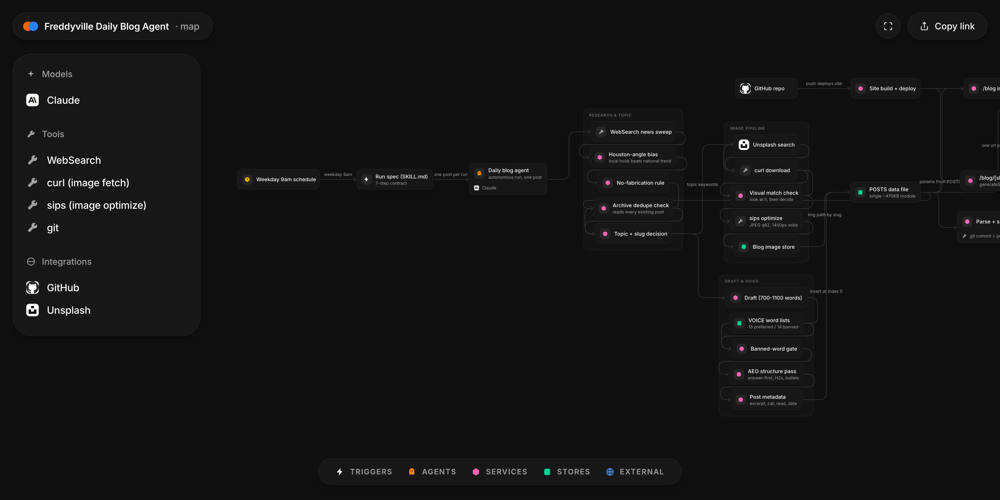

# Freddyville Daily Blog Agent

An unattended weekday agent that researches, writes, illustrates and ships one SEO/AEO blog post to a live production site.

[](https://fred-in-tech.github.io/freddyville-blog-automation/map/)

*Interactive, pannable version: [open the architecture map](https://fred-in-tech.github.io/freddyville-blog-automation/map/)*

## What it is

Every weekday at 9am, an agent wakes up on a schedule, searches the news, picks one timely angle with a real Houston hook, checks the existing archive so it never repeats itself, writes a 700–1100 word original post in my company's brand voice, finds and *visually verifies* a matching photo, inserts the post into the site's data file, confirms the file still parses, and pushes to GitHub — which deploys the site.

Status: **running**. It has been shipping posts into production on a weekday cadence, and the archive it writes into now holds 82 posts.

## Why I built it

Freddyville Media is a Houston video production company. Content marketing works for us, but a weekly-at-best publishing habit does not — and hiring for it costs more than the leads it returns at our size. What I actually needed was consistency: a post every weekday, on-brand, genuinely useful, structured so both Google and AI answer engines can quote it. That is a process problem, not a creative one, so I automated the process and kept the taste in the constraints.

## Architecture

The whole program is one markdown spec file. There is no server, no queue and no database — the git repo is the only durable state.

| Stage | What happens |
| --- | --- |
| **Trigger** | A weekday 9am schedule invokes the run spec. No human in the loop. |
| **Research** | A news sweep across AI-in-film, production tech and marketing, biased toward a concrete Houston angle over a national trend with a local CTA bolted on. Every stat has to trace to a real source URL. |
| **Dedupe** | The agent reads the entire existing archive before committing to a topic, so neither the angle nor the slug repeats. |
| **Draft** | 700–1100 original words, run against an explicit brand-voice word list, then restructured for answer engines: direct-answer opening, H2 sections, at least one bulleted list. |
| **Image** | Search Unsplash → download the candidate → *actually look at it* → reject if the subject or city is wrong → re-encode with `sips` to a fixed width and quality into the repo. |
| **Insert** | The post object goes in at index 0 of the `POSTS` array, with double-quoted metadata strings and a backtick body. |
| **Verify** | The edited module has to still parse and match the existing object shape before a commit is allowed. |
| **Ship** | One commit per post (data file + image together), pushed to `main`, which triggers the deploy. |

The publishing side is deliberately boring so the agent's job stays small: the Next.js app derives `/blog/[slug]` routes from the same array via `generateStaticParams`, so a single array insert creates a new statically rendered page, a new sitemap entry, and a new `BlogPosting` JSON-LD block with no other edits.

A run, end to end:

```
schedule → run spec → news sweep (Houston angle)
        → read archive, reject covered topics + taken slugs
        → draft → banned-word gate → AEO structure pass
        → image: search → download → VIEW → reject mismatch → optimize
        → insert at POSTS[0] → verify it parses
        → commit (post + image together) → push main → deploy
```

Every stage fails closed. The image stage loops back to search rather than accepting the best available; the verify stage blocks the commit rather than pushing a file that might not parse. Nothing is ever half-published, because the post object and its image land in the same commit or neither does.

## Engineering highlights

- **Brand voice as a hard constraint, not a prompt vibe.** The site ships an explicit `VOICE` object — 13 preferred words and 14 banned words and phrases ("cinematic", "world-class", "elevate", "bring your vision to life"). The agent treats the banned list as a gate: a hit means a rewrite, not a shrug. This is the single most effective anti-slop measure in the system, because generic LLM marketing copy reaches for exactly those words.
- **Duplicate avoidance by reading the archive, not by remembering.** The agent is stateless between runs, so before choosing a topic it reads the full post file and rejects anything already covered. State lives in the repo, which means a re-run, a missed day, or a run from a different machine all behave identically.
- **The image is verified by looking at it.** The classic unattended-publishing failure is a hero image that is topically wrong — a generic stock desk photo on a post about a convention centre, or the wrong skyline. So the pipeline downloads the candidate, views it, and rejects mismatches before optimisation. Fetching a plausible URL is not the same as having the right picture, and only one of those can be checked automatically.
- **No infrastructure, on purpose.** No server, no database, no queue — the git repo is the only durable state, and the agent recovers everything it needs to know about prior runs by reading it. That makes a run idempotent in the ways that matter: a missed day, a re-run, or a run from a different machine all behave identically, because the input is simply the current contents of `main`. It also makes the whole archive reviewable in `git log`, one `Blog:` commit per published post.
- **Written for extraction, not just for ranking.** Every post opens with a 1–2 sentence direct answer to the implied question, then H2 sections and bulleted lists. That structure is what lets an answer engine lift a self-contained claim and cite the source. The site backs it up: `robots.js` explicitly allows the major AI crawlers rather than leaving them to a default, and each post emits `BlogPosting` schema.
- **No fabricated facts, enforced at the research step.** Stats, quotes and product claims must come out of the search results with 1–2 source URLs carried into the piece. An agent that invents a plausible statistic is worse than one that publishes nothing, because the damage is silent and permanent.
- **Dates were shipping unusable, and the fix was a regex.** Post dates are authored for humans ("Sep 1, 2026") but schema.org needs ISO 8601 — Google discards anything else, so every post was going out with no usable date and no freshness signal. The parser is deliberate string work rather than `Date.parse` → `toISOString`, because that round-trip goes through the local timezone and shifts the date by a day west of UTC.
- **The renderer was silently breaking the content the agent wrote.** The post renderer originally handled only `**bold**`, so hundreds of bullet lines and markdown links across the archive were rendering as literal `- item` and `[text](url)` — meaning none of the internal links existed as links, passed any signal, or could be crawled. Fixing the renderer recovered value from every post already published. Post bodies are repo-authored, but hrefs are still restricted to `http/https/mailto//` and raw angle brackets escaped before any tag is introduced.

## Stack

| Layer | Tech |
| --- | --- |
| Orchestration | Claude Code scheduled task, one markdown run spec |
| Reasoning + authoring | Claude (text and vision in the same run) |
| Research | Web search |
| Images | Unsplash, `curl`, `sips` |
| Content store | A single JS module exporting a `POSTS` array (~470KB) |
| Site | Next.js 16 / React 19, static rendering via `generateStaticParams` |
| SEO/AEO | `BlogPosting` + `FAQPage` + `Service` JSON-LD, generated sitemap, explicit AI-crawler allowlist |
| Delivery | git → GitHub `main` → deploy on push |

## Status & roadmap

Running on a weekday cadence. Known limits and what is next:

- **No performance loop yet.** The agent picks topics from news, not from what actually ranked or got cited. Feeding search-console and referral data back into topic selection is the obvious next step.
- **One shape of post.** Everything is a 700–1100 word commentary piece. The data model already supports pillar posts that carry `Service` and `FAQPage` schema; the agent does not yet decide when to write one.
- **Image sourcing is stock-only.** Verified stock beats wrong stock, but a house-shot library would beat both.
- **Internal linking is manual.** The renderer supports links; choosing which older post to link is not yet part of the run.

## About this repo

This is a public architecture showcase of a private production codebase. The source stays private; this repo documents how it is built, what the constraints are, and the decisions worth explaining.

— Godfred Aidoo · [godfredaidoo.com](https://godfredaidoo.com) · [LinkedIn](https://www.linkedin.com/in/godfred-aidoo) · [more projects](https://github.com/Fred-In-tech)
